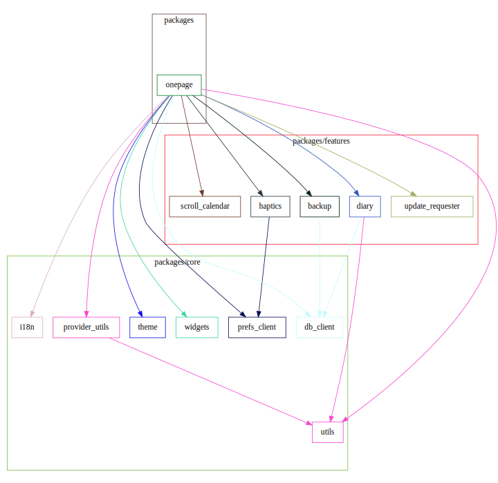

[](./LICENSE)
[](https://github.com/naipaka/onepage/actions/workflows/flutter-app-code-check.yml)
[](https://github.com/invertase/melos)
[](https://codecov.io/gh/naipaka/onepage)

# One Page

"One Page" is a simple diary app with no input pages or date pages, just "one page only."

## Packages overview

This project is experimentally divided into packages by feature.



### app (onepage)

This package contains the entry point of the application and is the main package of the application.

### i18n

This package supports the internationalization and localization of the application. All texts for translating the application's text are defined here.

### provider_utils

This package provides utility functions for the riverpod package.

### scroll_calendar

This package provides a scrollable calendar.

### theme

This package is responsible for the appearance of `ThemeData` and other appearance-related data used in Flutter apps.

### update_requester

This package manages application updates.

### utils

This package provides utility functions for the application.

### widgets

This package provides generic widgets for the application.

## How to start development

```shell
make
```

The `make` command will install the required Dart packages, such as FVM and Melos.

## How to create a new package

If the project name and the output directory name of the package are the same,
`--project-name` can be omitted.

```shell
# Package
flutter create -t package packages/{directory_name} --project-name {project_name}
# App
flutter create --org jp.co.altive packages/{directory_name} --project-name {project_name}
```

## How to run tests

To run tests for the project, use the following command:

```shell
melos run test
```

This command will execute all tests defined in the project.

## How to build the project

To build the project, use the following command:

```shell
melos run build
```

or 

```shell
melos run build:watch
```

This command will build the project for the specified platforms.
