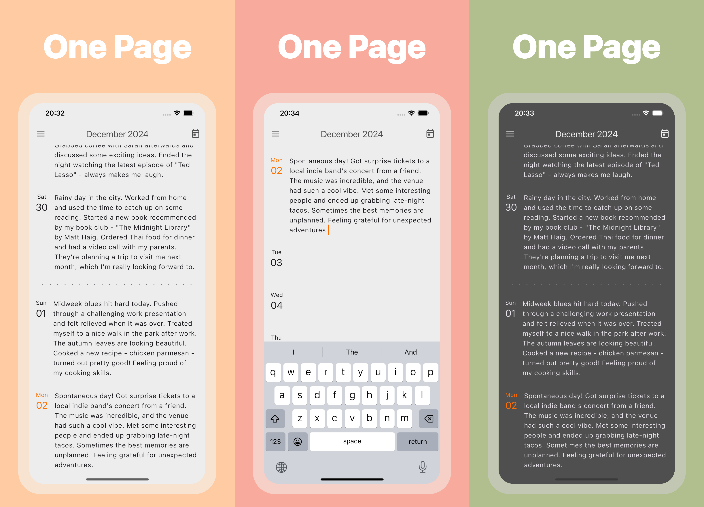
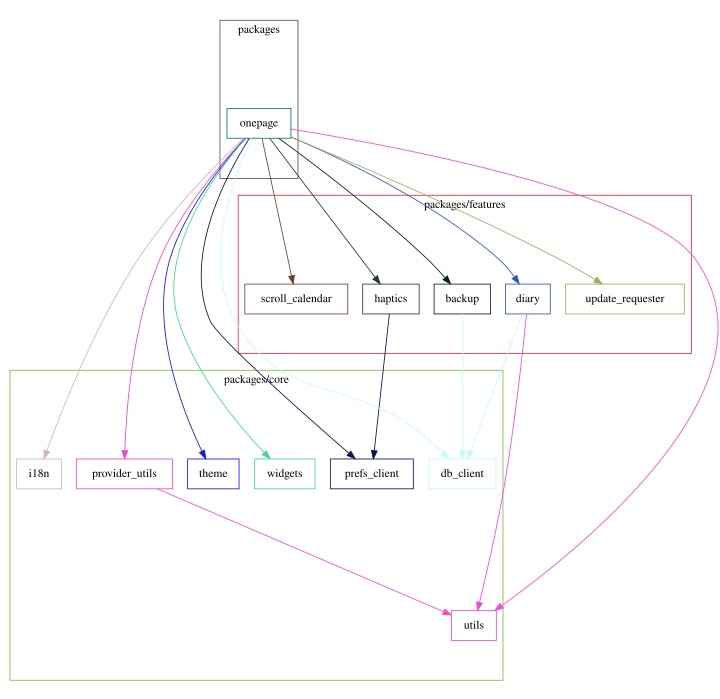

[](./LICENSE)
[](https://github.com/naipaka/onepage/actions/workflows/flutter-app-code-check.yml)
[](https://github.com/invertase/melos)
[](https://codecov.io/gh/naipaka/onepage)


[](https://apps.apple.com/app/id6738889085)
[](https://play.google.com/store/apps/details?id=com.naipaka.onepage)

# One Page

One Page is a Flutter diary app to write down your day quickly and look back with infinite scroll.
Every day has its own space on a single page, so you write right where the day is and scroll back through the past.



## Features

- Search your entries by keyword
- Attach one photo a day from your photo library
- Get reminders to write, at up to three times a day
- Back up to a file you can keep anywhere, such as iCloud or Google Drive, and restore from it
- Export your entries as PDF, CSV, or Markdown
- Available in English and Japanese
- No ads
- Your entries are stored on your device

## Packages overview

This project is experimentally divided into packages by feature, to see whether package boundaries can keep features independent of each other.
Packages under `packages/features` depend only on packages under `packages/core` and must not depend on each other.
Except for `provider_utils`, these packages do not use Riverpod; their classes take what they need as constructor arguments.
The app package wraps them in providers under `packages/app/lib/adapters` and combines features in its pages.

The dependency graph below is updated automatically: a GitHub Actions workflow opens a pull request whenever the dependencies change on `main`.



### App

| Package | Description |
|---|---|
| [app (onepage)](packages/app) | Entry point of the application |

### Core

| Package | Description |
|---|---|
| [configurator](packages/core/configurator) | Firebase Remote Config |
| [db_client](packages/core/db_client) | Database client built on Drift |
| [i18n](packages/core/i18n) | Translations for all texts in the app |
| [notification_client](packages/core/notification_client) | Local notifications for diary reminders, scheduled with time zones |
| [photo_client](packages/core/photo_client) | Selecting and viewing photos from the device library, including permissions and albums |
| [prefs_client](packages/core/prefs_client) | Type-safe wrapper around SharedPreferences |
| [provider_utils](packages/core/provider_utils) | Utilities for Riverpod |
| [theme](packages/core/theme) | `ThemeData` and other appearance settings |
| [tracker](packages/core/tracker) | Event tracking |
| [utils](packages/core/utils) | Utility functions |
| [widgets](packages/core/widgets) | Generic widgets |

### Features

| Package | Description |
|---|---|
| [backup](packages/features/backup) | Backup and restore |
| [diary](packages/features/diary) | The diary feature |
| [exporter](packages/features/exporter) | Export to CSV, PDF, and Markdown |
| [haptics](packages/features/haptics) | Haptic feedback that can be turned on and off in settings |
| [in_app_reviewer](packages/features/in_app_reviewer) | In-app review requests |
| [scroll_calendar](packages/features/scroll_calendar) | Scrollable calendar |
| [update_requester](packages/features/update_requester) | Application updates |

## How to start development

```shell
make
```

The `make` command installs FVM with Homebrew, installs the Flutter version pinned in `.fvmrc`, activates Melos and the FlutterFire CLI, and runs `dart pub get` for the workspace.

### Firebase Integration
The app uses Firebase Analytics, Crashlytics, and Remote Config.
Create your own Firebase projects for development and production.
The FlutterFire CLI requires the [Firebase CLI](https://firebase.google.com/docs/cli) and `firebase login`.

Run the following commands in `packages/app` and select your project.

#### For Development Environment
```shell
flutterfire configure --out=lib/environment/src/firebase_options_dev.dart --platforms=android,ios --ios-bundle-id=com.naipaka.onepage.dev --android-package-name=com.naipaka.onepage.dev
```

Move the generated files:
- `ios/Runner/GoogleService-Info.plist` and `ios/firebase_app_id_file.json` to `ios/dev/`
- `android/app/google-services.json` to `android/app/src/dev/`

#### For Production Environment
```shell
flutterfire configure --out=lib/environment/src/firebase_options_prod.dart --platforms=android,ios --ios-bundle-id=com.naipaka.onepage --android-package-name=com.naipaka.onepage
```

Move the generated files:
- `ios/Runner/GoogleService-Info.plist` and `ios/firebase_app_id_file.json` to `ios/prod/`
- `android/app/google-services.json` to `android/app/src/prod/`

### Environment Variables
In `packages/app/dart_defines`, copy `dev.env.default` to `dev.env` and `prod.env.default` to `prod.env`, then fill in the values.

## How to create a new package

Create a package under `packages/core` or `packages/features`.
If the project name and the output directory name of the package are the same,
`--project-name` can be omitted.

```shell
flutter create -t package packages/features/{directory_name} --project-name {project_name}
```

Then register the package in the workspace:
- Add the package path to `workspace` in the root `pubspec.yaml`.
- Add `resolution: workspace` to the package's `pubspec.yaml`.

## How to run tests

To run tests for the project, use the following command:

```shell
melos run test
```

This command will execute all tests defined in the project, including golden tests.

If you change the UI, update the golden images with the following command:

```shell
melos run golden:update
```

CI runs the tests, including golden tests, on macOS.

## How to generate code

To generate code with build_runner, including translations, use the following command:

```shell
melos run gen
```

or, to keep generating code while you edit:

```shell
melos run gen:watch
```

Generated files are committed to the repository, so commit them together with your changes.

## How to migrate the database

The database is defined with Drift in `packages/core/db_client`, and migrations are written step by step.
When you change a table:

1. Increase `schemaVersion` in `packages/core/db_client/lib/src/db_client.dart`.
2. Run `melos run drift:migrations` to save the new schema under `drift_schemas` and generate the migration steps and test helpers.
3. Write the migration for the new version in `migration`.
4. Run the tests in `packages/core/db_client`. `test/drift/onepage/migration_test.dart` checks the migration from every past schema version.

See the Drift documentation for details:
- https://drift.simonbinder.eu/migrations
- https://drift.simonbinder.eu/migrations/step_by_step/
